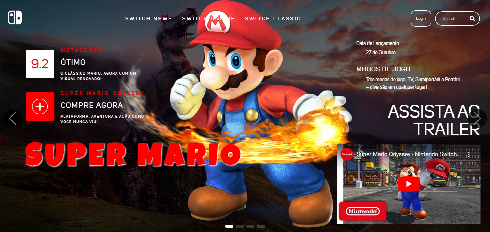

# Landing Page - Super Mario Games
<div align="center" id="topo">
  
  </div>

Este projeto é uma landing page dedicada aos jogos clássicos da Nintendo, com foco na série Super Mario. Desenvolvida para proporcionar uma experiência visual atraente e informativa, a página apresenta os jogos mais icônicos da franquia, com detalhes de cada título, trailers, metascores e links de compra. A página foi criada utilizando tecnologias web modernas e é completamente responsiva, proporcionando uma navegação intuitiva tanto em dispositivos móveis quanto em desktops.

> **Projeto realizado como atividade prática do curso Trilha FullStack da escola +PraTi em parceria com a Codifica.**

## 🌟 Funcionalidades Principais

- **Exibição de Jogos Clássicos**: Destaques de jogos com descrições detalhadas, metascores e modos de jogo.
- **Acesso a Trailers**: Links rápidos para assistir aos trailers dos jogos.
- **Botões de Compra**: Links de compra para fácil acesso e aquisição dos jogos.
- **Login Personalizado**: Área de login que permite uma experiência personalizada para cada usuário.
- **Layout Responsivo**: Design otimizado para diferentes dispositivos, garantindo uma visualização adaptada em qualquer tela.

## 📑 Tecnologias Utilizadas

- **HTML5** e **CSS3**: Estruturação e estilização da página.
- **JavaScript**: Interatividade e funcionalidade.
- **Bibliotecas Externas**: Integração de bibliotecas para efeitos visuais e responsividade.
- **Vercel**: Hospedagem do projeto.

## 🚀 Como Executar o Projeto Localmente

1. Clone este repositório:
   ```bash
   git clone https://github.com/seu-usuario/landing-page-supermario.git

 <h2 align="center"> Licença</h2>
  <div align="center">Copyright ©️ 2024 - Dev Full Stack 2.0 Jr <div>